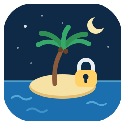

<p align="center">
  
</p>

# claude-island

Run [Claude Code](https://claude.com/claude-code) inside a kernel-enforced
sandbox. Claude can work on the current project and nothing else: your SSH
keys, tokens, dotfiles and other projects are invisible, and the network can
be reduced to an allowlist of domains. Built on
[Island](https://github.com/landlock-lsm/island) and
[Landlock](https://landlock.io).

## Quickstart

```sh
./install.sh                # builds Island and claude-island, checks the kernel

cd ~/dev/my-project
claude-island check         # prove the sandbox holds before trusting it
claude-island --rust        # sandboxed Claude Code, with your Rust toolchain
```

Review an untrusted repository, with the project read-only and the network
reduced to an allowlist of domains:

```sh
git clone https://github.com/someone/unknown-tool ~/dev/unknown-tool
cd ~/dev/unknown-tool
claude-island --ro --proxy
```

Full-stack work: several toolchains, a dev server, one extra domain:

```sh
cd ~/dev/my-app
claude-island --rust --node --serve --proxy --allow api.my-backend.dev
```

## What the sandbox does

Claude and every process it spawns get:

| | Allowed | Denied |
|---|---------|--------|
| Files | current project (rw), Claude state and caches, system dirs (read/exec) | everything else: `~/.ssh`, `~/.aws`, `~/.config/gh`, dotfiles, other projects, `$HOME` itself |
| Network | outbound TCP 443/80/53 (only the proxy port with `--proxy`) | listening, unless `--serve`/`--ports` |
| Local services | | D-Bus, Wayland and ssh-agent sockets, abstract sockets, signals to the outside |
| Resources | 8G RAM, 4096 tasks (systemd limits) | fork bombs, runaway builds |

Secrets are also scrubbed from the environment before launch
(`SSH_AUTH_SOCK`, `AWS_*`, `GITHUB_TOKEN`, npm/cargo tokens, ...).
Enforcement is done by the kernel (Landlock): restrictions are inherited by
all child processes and cannot be lifted once applied.

Don't trust it, verify:

```
$ claude-island check
[PASS] deny: list $HOME
[PASS] deny: read ~/.ssh
[PASS] deny: write ~/.zshrc
[PASS] deny: create a file in ~/.config/systemd/user
[PASS] deny: TCP bind on a non-allowed port (34567)
[PASS] allow: write inside the project
[PASS] allow: execute /usr/bin/true
...
result: OK, the sandbox holds its promises
```

Canaries cover the startup files of zsh, bash and fish plus `~/.profile`,
the persistence directories (systemd user units, desktop autostart), and
two self-escape targets: Island's own profiles and claude-island's config
(which holds the proxy allowlist).

## Install

Requirements: Linux kernel 6.12+ (Landlock ABI 6), Rust 1.89+.

```sh
./install.sh    # cargo-installs Island, builds claude-island into ~/.local/bin
```

The script also copies `~/.claude.json` into `~/.claude/` (the sandbox runs
with `CLAUDE_CONFIG_DIR=~/.claude`); a login may be requested once.

## Everyday usage

From a project directory under `$HOME`:

```
claude-island                       base sandbox
claude-island --rust                unlock cargo and rustup (already installed)
claude-island --rust --node --c     environments are stackable
claude-island --ro                  project in READ-ONLY mode (code review)
claude-island --proxy               network filtered by domain allowlist
claude-island --allow foo.dev       add a domain to the allowlist (repeatable)
claude-island check                 canary suite: verify the sandbox holds
claude-island check --ro            same, read-only variant
claude-island --list                list available environments
claude-island --serve               allow TCP bind on 3000, 4321, 5173, 8000, 8080
claude-island --ports 9000,9443     additional bind ports
claude-island --dry-run             show the generated profile and command
claude-island -- --resume           everything after -- is passed to claude
```

Tuning: `CLAUDE_ISLAND_MEM` (default 8G), `CLAUDE_ISLAND_TASKS` (default 4096).

## Dev environments

**An environment flag installs nothing.** It only unlocks access to a
toolchain that is already installed, and refuses with a clear message if it
is missing. Without the flag, the toolchain is simply invisible: `cargo
build` fails because `~/.cargo` cannot even be read.

| Flag | Checks | Unlocks |
|------|--------|---------|
| `--c`, `--cpp` | `cc`/`gcc`/`clang` | ccache caches, `~/.conan2` (compilers are in the baseline) |
| `--rust` | `~/.cargo`, `~/.rustup` | both, rw + exec |
| `--go` | `go` | `~/go`, `~/.cache/go-build` |
| `--python3` | `python3` | pip/uv caches, uv-managed pythons (venv lives in the project) |
| `--node` | `node`/`npm` | `~/.npm`, yarn cache, pnpm store, `~/.nvm` (exec only) |
| `--deno` | `deno` | `~/.deno`, deno cache |
| `--bun` | `bun` | `~/.bun` |
| `--jvm` (`--java`, `--kotlin`, `--scala`) | `java` | `~/.m2`, `~/.gradle`, `~/.ivy2`, `~/.sbt`, coursier, `~/.sdkman` (exec only) |
| `--ruby` | `ruby` | `~/.gem`, `~/.bundle`, `~/.rbenv` (exec only) |
| `--php` | `php` | composer dirs and cache |
| `--perl` | `perl` | `~/perl5`, `~/.cpan`, `~/.cpanm` |
| `--dotnet` | `dotnet` | `~/.dotnet`, `~/.nuget`, `~/.templateengine` |
| `--haskell` | `ghc`/`stack`/`cabal` | `~/.cabal`, `~/.stack`, `~/.ghcup` (exec only) |
| `--elixir` | `elixir`/`mix` | `~/.mix`, `~/.hex`, rebar3 cache |
| `--zig` | `zig` | zig cache |
| `--mise` | `mise` | everything mise manages, in one flag |

Languages whose toolchain lives entirely under `/usr` (shell, Lua, awk, and
C/C++ apart from caches) work without any flag.

Managed toolchain dirs (`~/.nvm`, `~/.sdkman`, `~/.rbenv`, `~/.ghcup`) are
execute only: `nvm install` or `npm install -g` happen outside the sandbox,
on purpose. Project-local installs work normally.

Custom environment without recompiling: drop a
`~/.config/claude-island/snippets/env-foo.toml` (same format as the files in
`snippets/`), then use `--foo`.

## Network filtering: `--proxy`

By default Landlock filters by port, so any host is reachable on 443.
`--proxy` replaces that with a domain allowlist, enforced by a small HTTP
CONNECT proxy that runs outside the sandbox; inside, only the proxy port is
reachable. The allowlist combines:

* base domains (Anthropic API, github.com and its CDNs);
* domains of the active environments (`--rust` adds crates.io, `--node` adds
  registry.npmjs.org, ...);
* your permanent additions, one per line:

```sh
# ~/.config/claude-island/domains.allow
api.my-backend.dev
gitlab.example.com          # a domain also covers its subdomains
```

* one-off additions: `--allow <domain>`.

Denials and grants are logged to `~/.cache/claude-island/proxy.log`: check
it to see what Claude actually tried to reach, and refine the list.

## Code review mode: `--ro`

For unknown repositories (unaudited code, possible prompt injection in the
README). The project becomes read + execute only: Claude can read, search
and run tools, but cannot modify the repository. Only its own state and the
isolated TMPDIR stay writable. Verify with `claude-island check --ro`.

Note: an `--ro` profile declares no Island `[[context]]`, because Island
grants full access beneath context paths (they are treated as workspaces).
The wrapper always selects profiles explicitly, so nothing is lost; the zsh
auto-activation hook simply never picks up an `--ro` profile.

## Good to know

* git works over HTTPS inside the sandbox; SSH push happens outside
  (`nosandbox git push` with the zsh hook). Neither keys nor agent are ever
  exposed.
* The `gh` CLI does not work inside (its token stays protected): use it
  outside.
* Tools that hardcode `/tmp` fail: `TMPDIR` points to an isolated,
  per-profile workspace.
* On an unexpected denial: `claude-island --dry-run` shows the generated
  profile, `island -v run -p <profile> -- <cmd>` gives verbose detail.
* Re-run `claude-island check` after every update of Island, claude-island
  or the kernel. Island itself is young ("work in progress, so be careful").
* Optional zsh integration, to auto-sandbox every command in profiled
  directories: `source <(island hook zsh)` in `~/.zshrc`. The claude-island
  binary itself works from any shell.

## How it works

Defense in depth, eight layers:

| Layer | Mechanism | Role |
|-------|-----------|------|
| 1 | Landlock filesystem (ABI 6) | deny by default; system read/exec, project and Claude state rw (`--ro`: project read-only) |
| 2 | Landlock network | `connect_tcp` limited to 443/80/53, `bind_tcp` opt-in |
| 3 | Filtering proxy (`--proxy`) | domain allowlist, only the proxy port reachable |
| 4 | Landlock scoped | signals and abstract UNIX sockets confined |
| 5 | Island workspaces | XDG and TMPDIR isolated per profile |
| 6 | Environment scrubbing | secrets and agent handles removed |
| 7 | `systemd-run --scope` | `MemoryMax`, `TasksMax` |
| 8 | Claude Code's native sandbox | stacks freely (Landlock allows 16 nested layers) |

The wrapper is a single Rust binary; the policy snippets (`snippets/`) are
embedded at compile time. On each launch it generates a profile under
`~/.config/island/profiles/claude-<project>[-envs][-ro]-<hash>` and runs
`island run -p <profile> -- claude` under systemd resource limits.

Key Island semantics: TOML files within one profile compose as a **union**
(an environment flag can add rights), while stacked profiles compose as an
**intersection** (they can only reduce rights). That is why environments are
snippets copied into a single generated profile, never stacked profiles.

Design notes:

* `CLAUDE_CONFIG_DIR=~/.claude` keeps all Claude state in the single
  writable state directory (avoids granting file creation and deletion at
  the root of `$HOME` for the config's atomic rename).
* The Claude binary is read-only and its auto-updater disabled
  (`DISABLE_AUTOUPDATER=1`): a compromised Claude cannot replace itself.
  Update outside the sandbox.
* `~/.gitconfig` is readable (commit identity) but never writable;
  `~/.git-credentials` stays denied.

## Limitations

* Without `--proxy`, any host is reachable on 443. With it, exfiltration is
  still possible towards the allowlisted domains themselves: keep the list
  minimal.
* UDP is not covered by Landlock (QUIC/HTTP-3 passes), except with
  `--proxy` where only the proxy's TCP port is reachable.
* File metadata (stat) is not restricted; file contents are.
* No protection against kernel vulnerabilities or compromised privileged
  services.

## License

[GPL-3.0-or-later](LICENSE).
